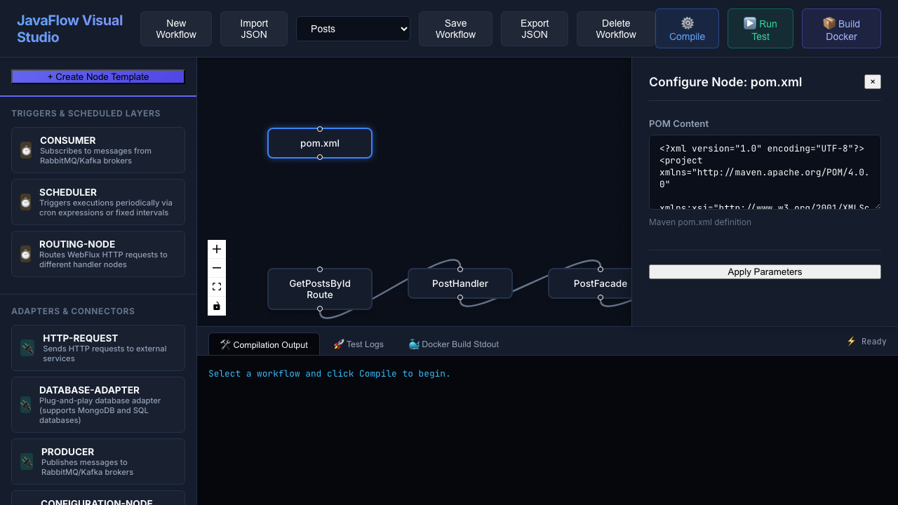
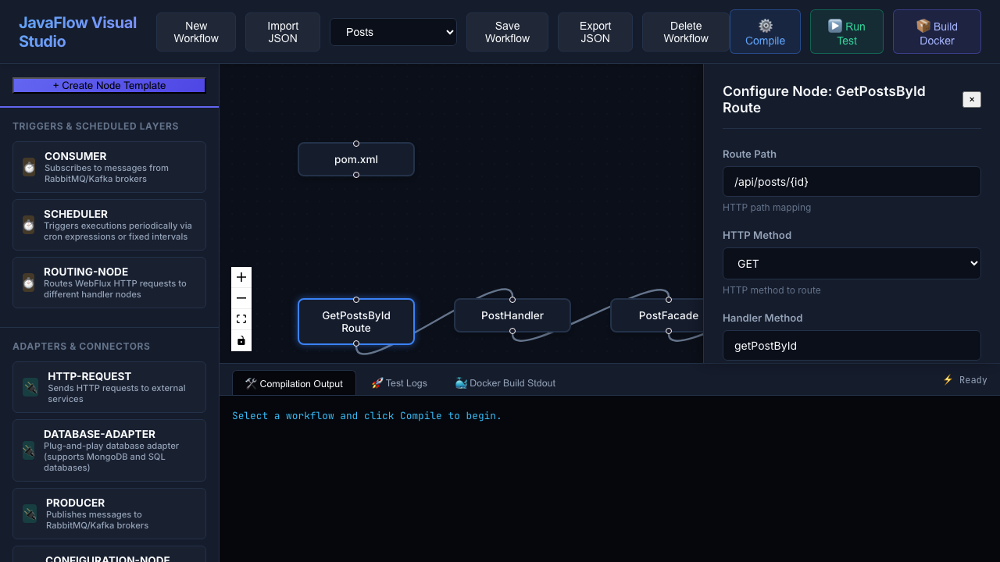
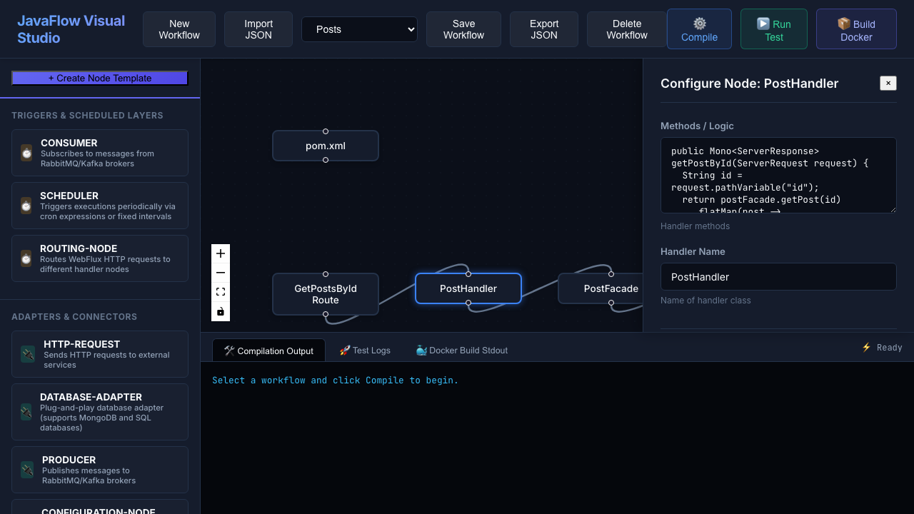
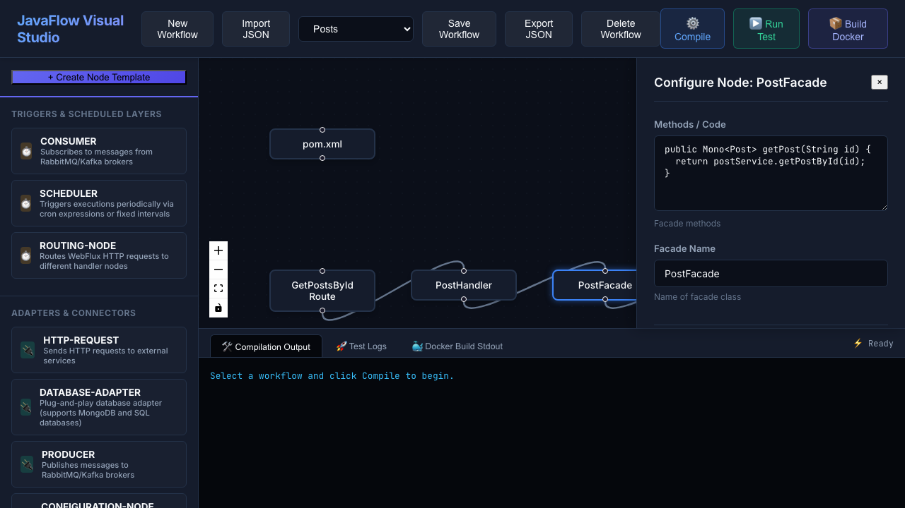
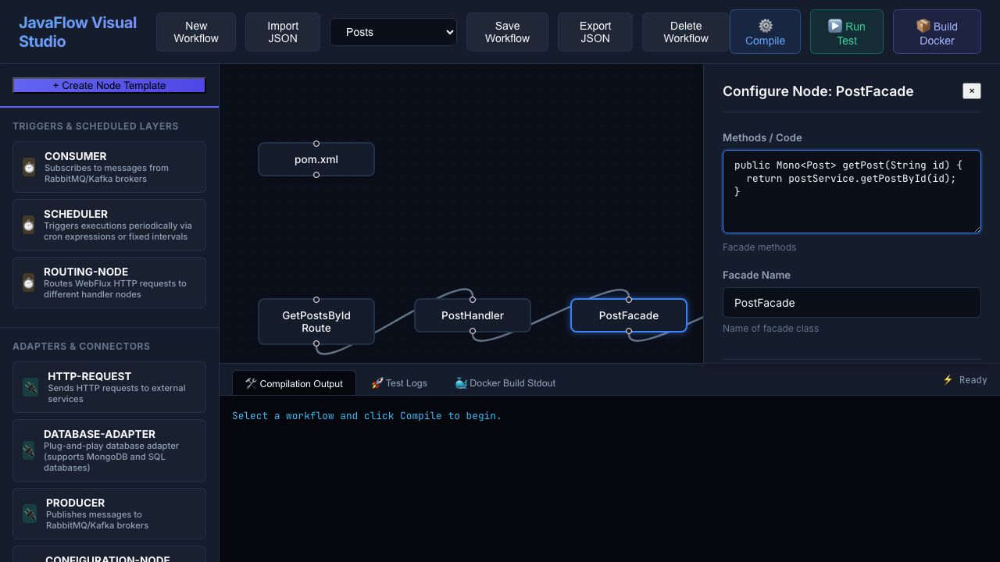
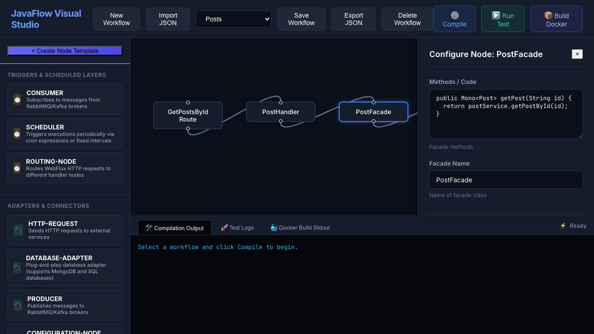
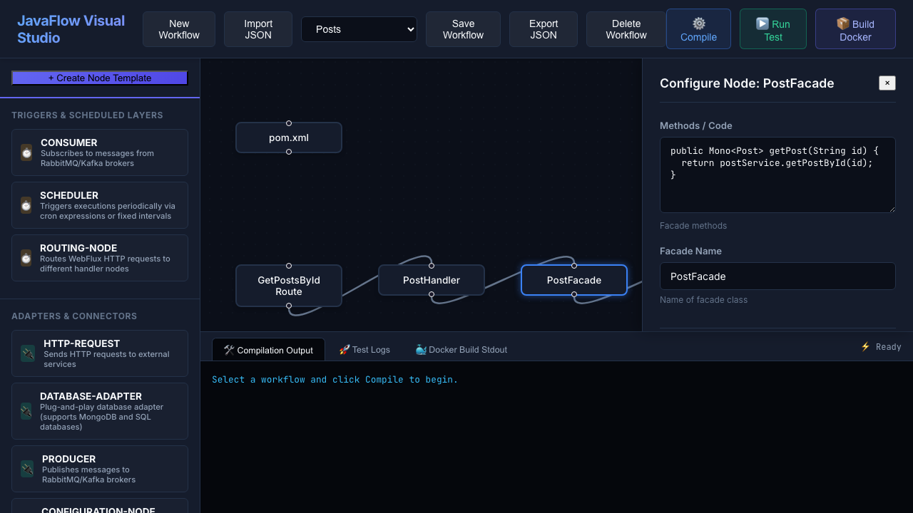
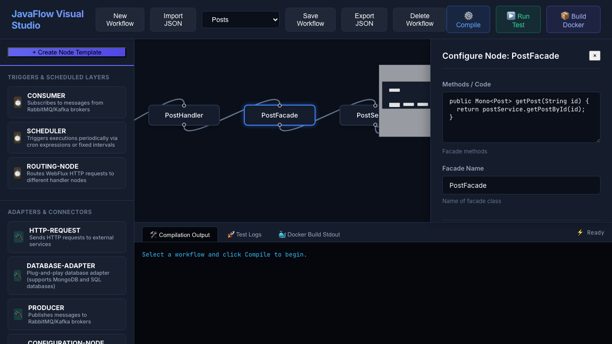

# 🌀 JavaFlow Visual Studio

A premium, agentic, non-blocking visual orchestrator designed to compose, compile, test, and package **Spring WebFlux Java Microservices** in real-time. Inspired by `n8n` and built on top of React Flow and Spring Boot, it bridges visual flow architectures directly to native Java structures.

---

## ⚡ Core Highlights

- 🎨 **Visual Microservice Composition**: Drag, connect, and customize WebFlux controllers, handlers, facades, services, repositories, and entities.
- 📦 **Dynamic Java Project Exporter**: Generates complete Java maven packages directly onto the host filesystem, complete with `pom.xml`, `application.yml`, and clean, ready-to-run code.
- 🔄 **Host Maven Dependency Caching**: Integrates host volume mounts to sync and pre-download jar dependencies directly to `~/.m2` using containerized Maven offline tasks.
- 🚀 **Live Integration Test Runner**: Connects to external APIs (using reactive `WebClient`) and runs full integration sequences in memory, outputting step-by-step console logs.
- 📂 **Portability**: Import and export workflow configurations as standard JSON schema files.

---

## 📸 Seeded Ingestion Workflow: "Posts" CRUD Pipeline

We have seeded a complete end-to-end GET `/api/posts/{id}` data ingestion workflow. Below is a detailed walkthrough of each architectural node layer and its parameters:

### 1. Maven Project Configuration (`pom.xml`)
Defines the Spring Boot starter parent and registers reactive dependencies (WebFlux, Lombok, MongoDB).


### 2. Router Layer (`GetPostsById Route`)
Specifies the HTTP path `/api/posts/{id}` and maps the GET operation to the `PostHandler`.


### 3. Handler Layer (`PostHandler`)
Extracts the route path variables and passes the incoming payload down to the Facade component.


### 4. Facade Layer (`PostFacade`)
Decouples request/response formatting from business logic by delegating variables to the service.


### 5. Service Layer (`PostService`)
Executes the business logic, logs debug traces, triggers the HTTP client, and saves the entity to MongoDB.


### 6. WebClient Layer (`PostWebClient`)
Executes a live non-blocking HTTP GET call to retrieve the requested post resource.


### 7. Entity Layer (`Post`)
Defines the POJO structure with Lombok annotations (`@Data`, `@Builder`, `@NoArgsConstructor`, `@AllArgsConstructor`) and maps to the target MongoDB collection.


### 8. Repository Layer (`PostRepository`)
Extends the Spring Data `ReactiveMongoRepository` interface to provide built-in CRUD operations.


### 9. Database Adapter (`Admin DB Adapter`)
Holds the database credentials and coordinates connectivity to MongoDB.


---

## 🏗️ Quick Start

### Prerequisites
- Docker & Docker Compose
- Java 17+ & Node.js 18+ (if running bare-metal)

### Running with Docker (Recommended)
Launch the complete stack (MongoDB, Backend Spring WebFlux, Frontend Visual Editor):
```bash
docker-compose up --build
```
Access the services at:
- **Visual Studio Frontend**: [http://localhost:3000](http://localhost:3000)
- **Backend API**: [http://localhost:8080/api](http://localhost:8080/api)
- **Dynamic API Docs**: [http://localhost:8080/webjars/swagger-ui/index.html](http://localhost:8080/webjars/swagger-ui/index.html)

---

## 📖 Developer Documentation
For details on standard configuration schemas, extending node types, and system architecture, check out the [Developer Documentation](docs/developer_docs.md).

---

## 🤝 Credits & Collaborations
- **JSONPlaceholder**: Special thanks to [JSONPlaceholder](https://jsonplaceholder.typicode.com/) for supplying the mock REST API backend used to test the reactive HTTP WebClient integration pipeline.
- **Antigravity 2.0**: Developed in collaboration with the Antigravity 2.0 AI pair programming agent by Google DeepMind.
