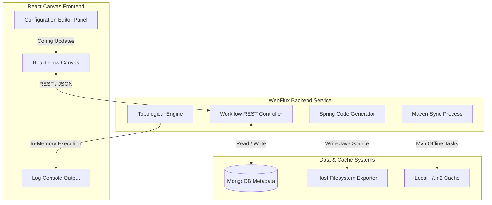

# 🏛️ JavaFlow Visual Studio Architecture

JavaFlow Visual Studio is designed around reactive programming, visual flow mapping, and dynamic code generation. This document describes the High-Level Architecture (HLD) and Low-Level Design (LLD) of the application.

---

## 🗺️ High-Level Architecture (HLD)

The system consists of three main tiers: a **React Visual Canvas**, a **Spring WebFlux Reactive API**, and **Docker Infrastructure** executing local compilers.

---

## ⚙️ Core Architecture Layers

### 1. Visual Flow Canvas (`frontend`)
- **React Flow Graph**: Maps nodes (representing WebFlux controllers, components, and clients) and topological edges (data flow paths) visually.
- **Node-DTO Mapping**: Seamlessly translates React Flow's nested state model (`data: { label, config }`) to the backend flat REST data model (`NodeDto`) on load and save.
- **Dynamic Terminal Panel**: Visualizes compilation output logs and execution test runner states.

### 2. Spring WebFlux REST Layer (`backend`)
- **`WorkflowController.java`**: Exposes endpoints for CRUD operations and triggers compilation/test pipelines.
- **`NodeTypeController.java`**: Manages registration of standard architectural nodes and user-defined custom nodes.

### 3. Topological Sort Test Engine (`WorkflowExecutorService.java`)
- **Kahn's Sort Algorithm**: Resolves node connectivity dependencies and orders them topologically to ensure upstream data resolves before downstream nodes execute.
- **In-Memory Pipeline**: Coordinates executing dynamic logic (e.g. running the `WebClientNodeExecutor` to fetch REST results, and writing payload records to the database).
- **Cycle-Safe Sanitization**: Strips circular references from the data context maps on each execution step to avoid MongoDB serialization StackOverflowErrors.

### 4. Microservice Code Exporter (`WorkflowController.java`)
- **Folder Skeleton Builder**: Creates structured Java package hierarchies (e.g. `com.example.javaflow`) at selected host paths.
- **Lombok Entity Builder**: Generates compile-ready Java classes decorated with Lombok builder annotations (`@Data`, `@Builder`, `@NoArgsConstructor`, `@AllArgsConstructor`).
- **Maven Offline Link**: Spawns a background `ProcessBuilder` that executes `mvn dependency:go-offline` inside the target directory, pre-resolving libraries into the host's `~/.m2` folder.

---

## 💾 MongoDB Collection Schema

We persist three main document types:
- **`workflows`**: Holds the node arrays, edge connectors, names, and descriptions.
- **`nodetypes`**: Stores standard and custom-registered template categories and default parameter configurations.
- **`executionlogs`**: Records the status, timestamps, and serialized input/output payload maps for each node execution run.
